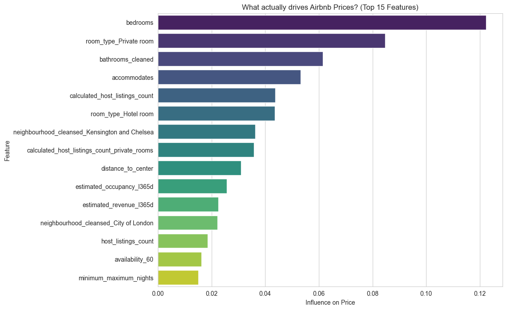
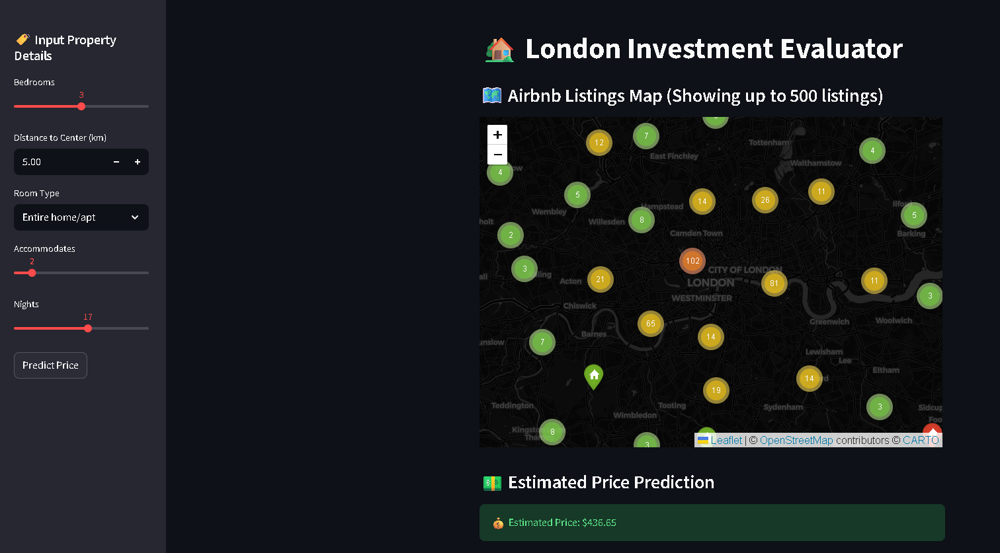

# London-Real-Estate-Investment-Estimator
An End-to-End Machine Learning tool that identifies undervalued properties in London by analyzing Geospatial, Textual, and Physical data.


## 🚀 The Business Problem

Real Estate investors in London face a massive data problem: **Price does not equal Value.**


A property listed for $100/night might be a steal, while one at $150 might be overpriced junk.

Traditional analysis looks at simple averages, missing the nuance of "Vibe" (guest reviews) and precise location dynamics.

**The Solution:**
I built an End-to-End Machine Learning Engine that:

1. **Estimates Fair Value** for any property based on 150+ features.
2. **Identifies Arbitrage Opportunities:** Properties where `Actual Price` < `Predicted Price` (Undervalued Gems).
3. **Quantifies "Vibe":** Uses NLP to turn guest sentiment into hard data.

---

## 📊 Key Results & Insights

* **Model Performance:** Achieved an **R² of 0.82** and **MAE of $28**, meaning the model explains 82% of the market variance.
* **The "Vibe" Reality:** `Bedrooms` and `Privacy` drive price **3x more** than positive sentiment. Guests *compliment* the host, but they *pay* for space.
* **Location Decay:** Properties within **5km** of the center command a 40% premium, following a strict exponential decay curve.

### **1. What actually drives price?**



### **2. The Market Map**


## **3. Streamlit Deployment**



---

## 🛠️ Tech Stack & Methodology

This project follows a 4-layer Data Science architecture:

| Layer | Technology | Description |
| --- | --- | --- |
| **1. Engineering** | `Pandas`, `NumPy` | Cleaned 96,000 raw rows, parsed complex text (Amenities), and imputed missing values. |
| **2. Geospatial** | `Folium`, `Haversine` | engineered `Distance_to_Center` feature and built interactive cluster maps. |
| **3. NLP** | `NLTK (VADER)` | Analyzed 50,000+ guest reviews to generate a `Sentiment_Score` (-1 to +1) for every listing. |
| **4. Machine Learning** | `XGBoost`, `Scikit-Learn` | Trained a Gradient Boosting Regressor to predict price with 82% accuracy. |
| **5. Deployment** | `Streamlit` | Built a user-facing app for investors to test scenarios (e.g., *"What if I add a pool?"*). |

---


## 📂 Repository Structure

```text
├── app.py                   # The Streamlit Application (Deployment)
├── notebook_analysis.ipynb  # The Core Analysis (Cleaning, EDA, ML Training)
├── xgb_model.json           # Trained XGBoost Model
├── model_columns.joblib     # Saved feature names for consistency
├── app_data.csv             # Lightweight data for the map visualization
├── requirements.txt         # List of libraries
├── README.md                # Project Documentation
└── Visuals/                  # Screenshots for README

```


### **Author**

**Ahmed A. Elatwy**

* [LinkedIn](https://ahmedelatwy.github.io/Ahmed-Elatwy-portfolio/)
* [Portfolio](https://www.linkedin.com/in/ahmed-elatwy/)

*Built as a Capstone Project demonstrating Full-Stack Data Science capabilities.*
