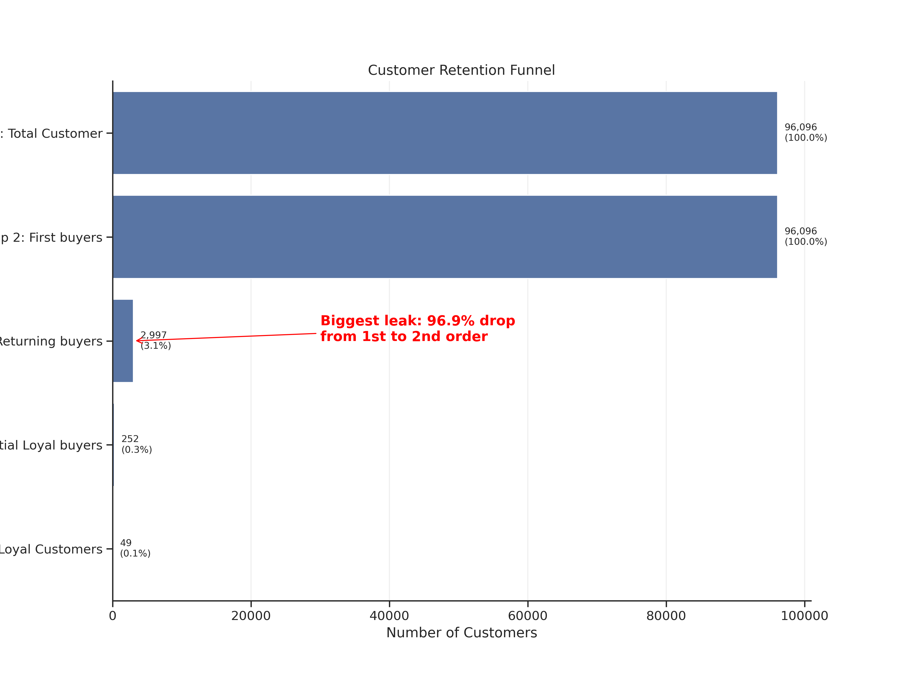
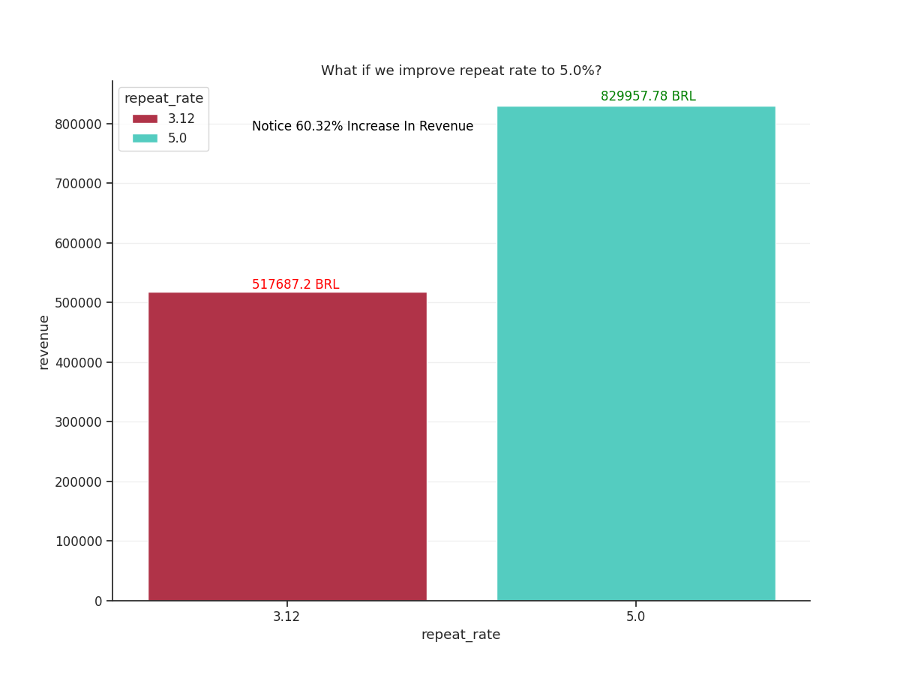

# 🛒 Olist E-Commerce Retention Analysis

> **Analyzing 100K+ orders to uncover drivers of customer retention and quantify revenue opportunities**

---

## 🎯 Business Question

What drives customer retention in a Brazilian e-commerce marketplace, and where are the biggest **revenue opportunities** to improve repeat purchases?

---

## 💰 Key Findings (Executive Summary)

| Metric | Value | Business Impact |
|--------|-------|----------------|
| **Overall repeat purchase rate** | 3.12% | 96.9% of customers never make a 2nd order |
| **Revenue opportunity** | +312K BRL (~$62K USD) | If repeat rate improves from 3.12% → 5% |
| **Best-retaining category** | Home Essentials (26%) | 2.5x higher than Toys/Gifts (10%) |
| **Retention trend** | -0.28%/month | Statistically significant decline (p<0.001, R²=0.70) |
| **Average Order Value (AOV)** | 172.73 BRL | Basis for revenue modeling |

---

## 📊 Visualizations

### Customer Retention Funnel

*96K customers → 3K repeat buyers. Biggest leak: Step 3 (first → second order).*

### Revenue Impact Model

*Improving repeat rate to 5% = +312K BRL/month revenue opportunity.*

---

### Prerequisites
- Python 3.8+
- Required packages: `pandas`, `matplotlib`, `seaborn`, `scipy`

---
### Data Processing
- Filtered to **completed orders only** (`order_status == 'delivered'`)
- Excluded cohorts **<60 days old** to avoid incomplete repeat behavior
- Filtered categories/cities with **<500 customers** to reduce noise

### Statistical Validation
- Trend significance tested via linear regression (`scipy.stats.linregress`)
- Repeat rate = customers with ≥2 orders / total customers
- AOV calculated from `payment_value` column: **172.73 BRL**

### Limitations
1. **Observational data**: Correlation ≠ causation. Findings require A/B testing for validation.
2. **Time window**: Dataset ends Aug 2018; newer customer behavior not captured.
3. **Geographic granularity**: City-level analysis may mask neighborhood patterns.
4. **Missing features**: No customer demographics or marketing touchpoint data.

---

## 💡 Key Recommendations

1. **Prioritize home essentials categories** for retention campaigns (2.5x higher repeat rate)
2. **Launch a 2nd-order incentive** for first-time buyers of non-essential categories
3. **Investigate retention decline** via customer surveys targeting 2018 cohorts
4. **Monitor cohort repeat rates monthly** as a leading indicator of business health

*Full recommendations with owners + timelines in `insights.md`*

👤 Author
  Ahmed Elatwy.
  
🔗 [LinkedIn Profile](https://www.linkedin.com/in/ahmed-elatwy/)

📧 ahmed.abbas.elatwy@gmail.com

🇪🇬 Based in Egypt | Open to freelance + full-time analytics roles

