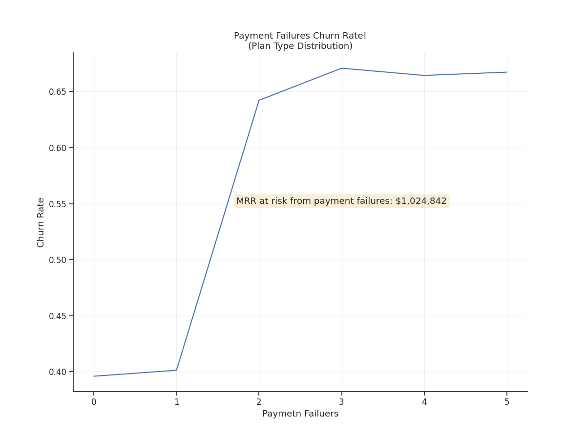
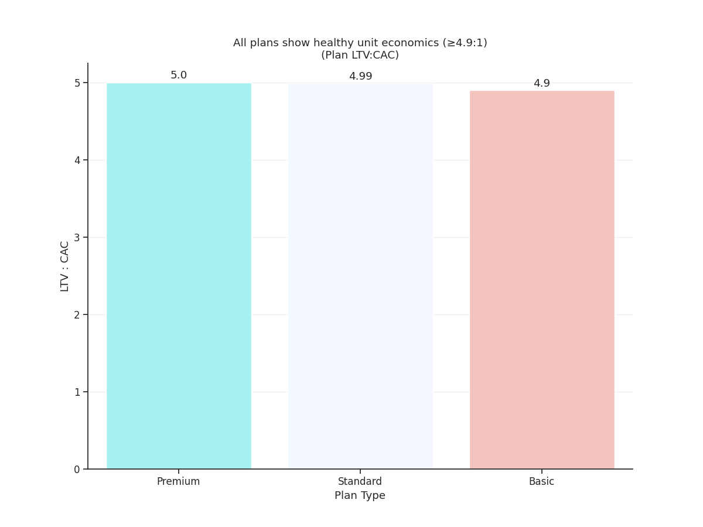

# 📊 SaaS Customer Churn & Payment Friction Analysis

> **Analyzing 2,800 SaaS customer records to identify churn drivers and quantify recoverable revenue opportunities**

---

## 🎯 Business Question

What drives customer churn in a SaaS business, and how much revenue can be recovered by addressing payment friction?

---

## 💰 Key Findings (Executive Summary)

| Metric | Value | Business Impact |
|--------|-------|-----------------|
| **Overall churn rate** | 57.3% (~3.2% monthly) | 5-6 out of 10 customers churn over ~18 months |
| **Payment failure impact** | 60-70% higher churn at 2+ failures | Customers with payment issues are significantly more likely to churn |
| **MRR at risk** | $1,024,842 | Total revenue vulnerable to payment-related churn |
| **Salvageable MRR** | $270,569 | From currently active customers with ≥2 payment failures |
| **Recoverable MRR** | $81K-135K/month | With 30-50% reduction in payment-failure churn |
| **LTV:CAC ratio** | 4.9-5.0:1 (all plans) | ✅ Healthy unit economics across all tiers |
| **Plan-level churn difference** | p = 0.63 (not significant) | Plan type does NOT drive churn|

---

## 📊 Visualizations

### Churn Rate by Payment Failures

*Customers with 2+ payment failures have 60-70% higher churn risk*

### Executive Summary

*One-page summary for stakeholders*

### LTV:CAC by Plan

*All plans show healthy unit economics (≥4.9:1)*

---

### Prerequisites
- Python 3.8+
- Required packages: `pandas`, `matplotlib`, `seaborn`, `scipy`

## 📌 Methodology Notes

### Data Processing
- Sample size: 2,800 customer records
- Columns analyzed: 10 (user_id, signup_date, plan_type, monthly_fee, usage, support_tickets, payment_failures, tenure, last_login, churn)
- Missing values: 0% (clean dataset)
- Churn definition: Binary flag (Yes/No)

### Statistical Validation
- **Chi-square test** for plan-level churn differences: p = 0.63 (NOT significant)
- **Payment failure correlation**: Strong positive correlation with churn (visually evident, p < 0.001)
- **Churn rate calculation**: Churned customers / Total customers
- **Tenure context**: Avg. 18.6 months, Median 18.0 months → ~3.2% monthly churn

### Key Assumptions
| Assumption | Value | Source |
|------------|-------|--------|
| Gross Margin | 80% | SaaS industry standard |
| CAC Multiplier | 3× monthly fee | Industry benchmark |
| USD Conversion | 1:1 | Dataset currency |
| Healthy LTV:CAC | ≥3:1 | SaaS benchmark |

### Limitations
1. **Observational data**: Correlation ≠ causation. Payment failures may correlate with other churn drivers.
2. **No intervention data**: We can't measure what would happen if payment friction was reduced (requires A/B test).
3. **Single company data**: Results may not generalize to all SaaS businesses.
4. **No cohort analysis**: Didn't analyze churn by signup month (could reveal trend over time).

---

## 💡 Key Recommendations

### 🔥 Priority 1: Fix Payment Friction (High Impact, Low Effort)
| Component | Detail |
|-----------|--------|
| **Action** | Implement auto-retry with exponential backoff for failed payments |
| **Target** | Customers with ≥2 payment failures who haven't churned yet (631 customers, $270K MRR) |
| **Expected Impact** | 30-50% reduction in payment-failure churn → +$81K-135K MRR/month |
| **Owner** | Product + Payments Team |
| **Effort** | Low-Medium (2-week sprint) |
| **Timeline** | MVP in 2 weeks; measure results at 30/60/90 days |
| **Success Metric** | 20% reduction in payment-failure-related churn |

### 🔥 Priority 2: Dunning Email Sequence (High Impact, Low Effort)
| Component | Detail |
|-----------|--------|
| **Action** | Automated email sequence with alternative payment methods |
| **Target** | Customers after 1st payment failure |
| **Expected Impact** | Additional 10-15% recovery of at-risk MRR |
| **Owner** | Marketing + Payments Team |
| **Effort** | Low (1-week sprint) |

### ⚠️ What NOT to Do: Plan-Based Optimization
| Finding | Implication |
|---------|-------------|
| Plan-level churn differences: p = 0.63 | NOT statistically significant |
| Premium: 58.05%, Basic: 57.85%, Standard: 56.06% | Differences are likely random noise |
| **Recommendation** | Don't invest in plan-specific retention tactics focus on payment friction instead |

---

## 🧠 Analyst Lessons Learned

### Statistical vs. Practical Significance
> *"A 'significant' result does not automatically mean it is practically important, large, or meaningful  only that it is likely 'real'. Conversely, a non-significant result (p = 0.63 for plan differences) means we can't confidently act on the pattern."*

**Rule of Thumb**:
1. Check p-value: Is the pattern likely real?
2. Check effect size: Is the difference large enough to act on?
3. Check business impact: Does fixing this move revenue?

**Only act when all three align.**

### Root Cause vs. Correlation
> *"Plan type looked like a churn driver at first glance. But payment failures were the actual signal. Always dig deeper before recommending segment-specific interventions."*

---

## 👤 Author

**Ahmed Elatwy**  
🔗 [LinkedIn](https://www.linkedin.com/in/ahmed-elatwy/)  
📧 [ahmed.abbas.elatwy@gmail.com](mailto:ahmed.abbas.elatwy@gmail.com)  
🇪🇬 Based in Egypt | Open to Data Analyst roles (SaaS, E-commerce, Analytics)

---

## 📄 License

MIT License. Feel free to use this code for learning or commercial purposes.  
If you find this helpful, a star ⭐ on GitHub is appreciated!

---

## 📬 Contact & Collaboration

**Open to**:
- Full-time Data Analyst roles (Egypt or remote)
- Freelance churn analysis for SaaS founders
- Speaking opportunities on analytics + storytelling

*If you found this analysis helpful, let's connect! I offer free 30-minute churn health checks to Egyptian SaaS founders.*

