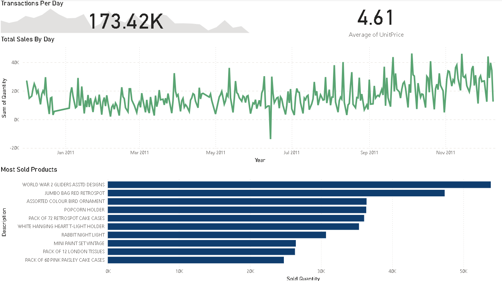

# retail Data Cleaning, analysis and visualization to find how to imporove the sales deployed improved data analysis.
# project link : https://www.kaggle.com/code/ahmedealtwy/online-retail-analysis
# Overview
The project focuses on leveraging data science techniques to enhance sales performance for an online retail dataset. This project, involves a comprehensive workflow that includes data cleaning, exploratory data analysis (EDA), and visualization to uncover actionable insights for improving sales strategies.
# Solution
### Data Loading and Exploration:
imported necessary Python libraries (such as Pandas, NumPy, and Matplotlib) in a Jupyter Notebook. Then, I loaded the retail dataset, checked for missing values, and explored basic statistics

### Data Cleaning:
handled missing data, removed duplicates, and standardized column names.

### Exploratory Data Analysis (EDA): 
Using visualizations (bar plots, line plots, etc.), I examined sales trends, customer behavior, and product performance.

# Approach
### Time Series Analysis: 
To understand sales trends over time, I applied time series decomposition and identified seasonal patterns.

### Customer Segmentation: 
group customers based on purchasing behavior.

### Product Performance Metrics: 
I calculated metrics like revenue per product category and identified top-selling items.

### Visualization: 
I created interactive charts (using Matplotlib or Seaborn) to communicate findings effectively.

# Conclusion
○ Initiated Data Cleaning, Analyzing and Visualization using proper tools and analytical skills.

###  Deployed Improved Data Analysis which led to the next findings
- **Almost All Months Have the same amount of orders around 7.8% to 8.8% except April with only 6.8% and december with 9.2%**
- **From January To April total share is 23.09%, while from May to August 28.8%, and from Septemper to December 48.11% with the highest on september with 14.74% of total product sold**
- **While Uk is the highest in orders with 334k and 4.43m in total price Netherlands hold the highest Total Price per Order with 38.314933**
- **UK Holds 90% of Total Orders and 85% of Total Price spent**
- **Cpuntries Like Lithuania, Lebanon, Netherlands and Singapore are the top 5 countries in Price per order with combined share less than 1%**
- **REGENCY CAKESTAND 3 TIER is the most profitable product with income of 88401.40$**

- **PACK OF 72 RETROSPOT CAKE CASES	is the most sold item with total of 15.09k**

- **Customer '17841' is the most frequent customer with total orders over 7.8k, while customer '14911' is the most spending with total of 10.6k $**

# Skills: Data Analysis · Data Visualization · Python (Programming Language) · Pandas · Exploratory Data Analysis · Microsoft Power BI
