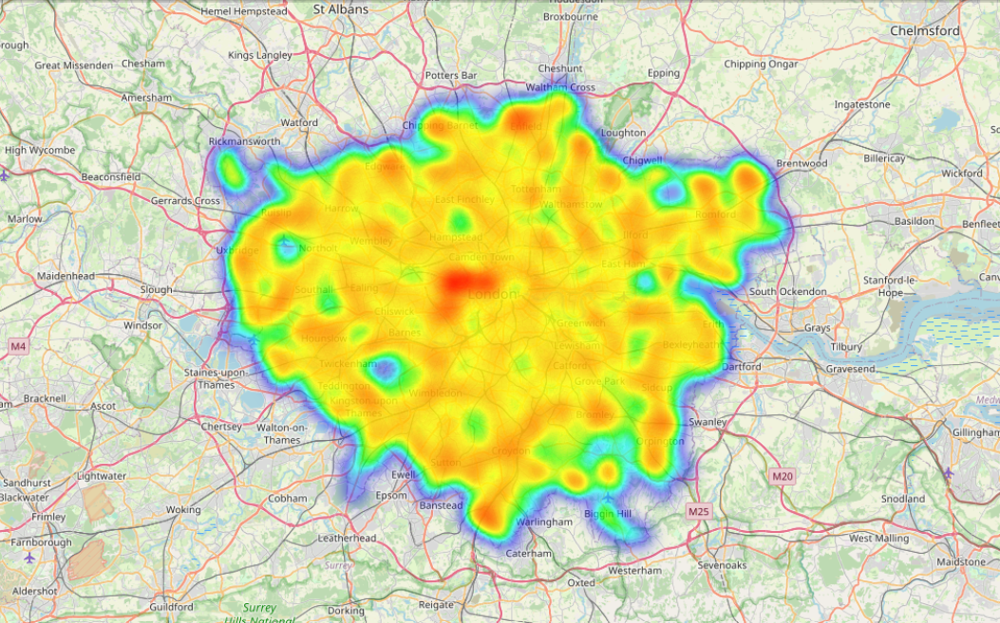
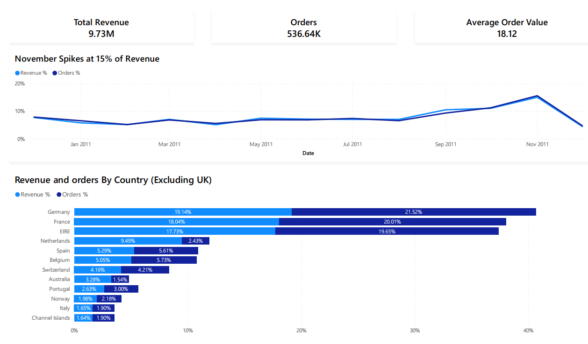
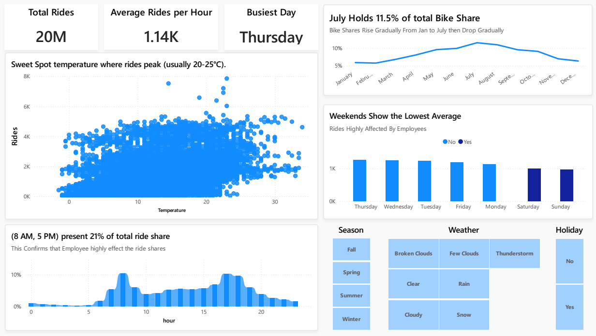
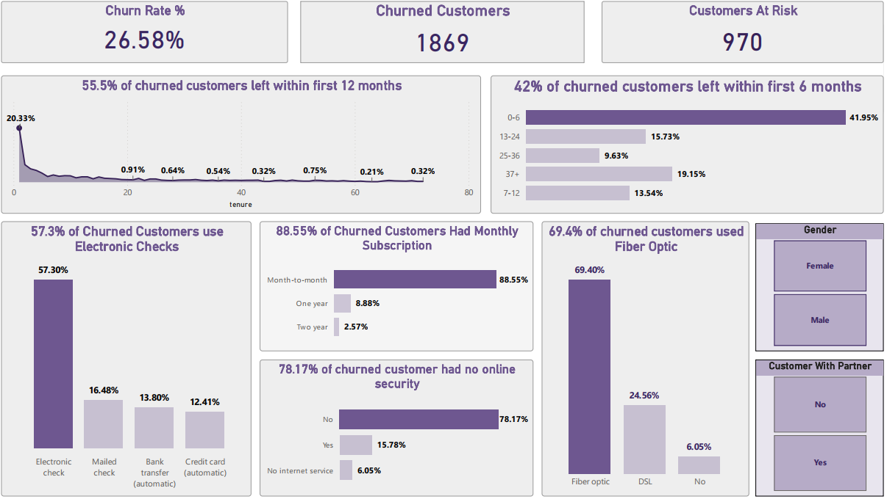
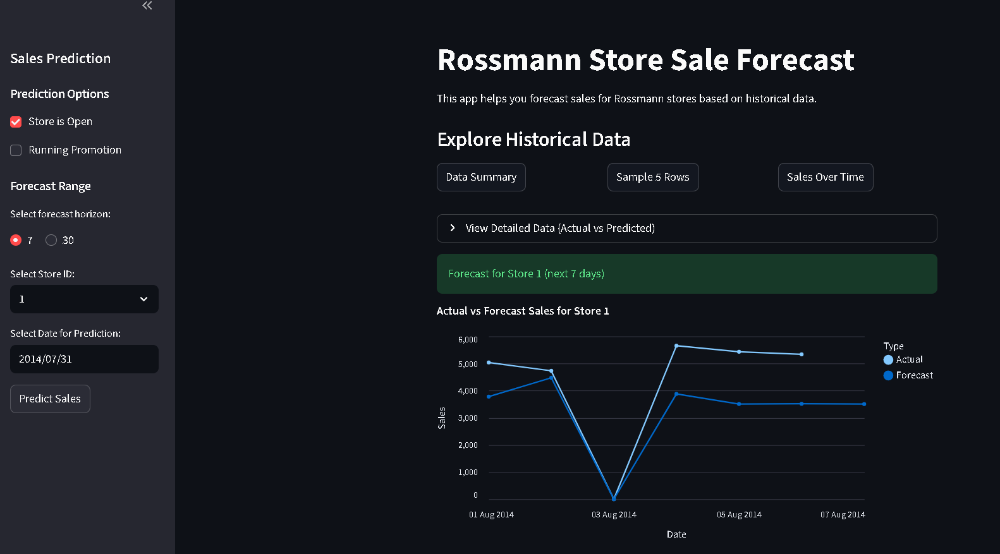
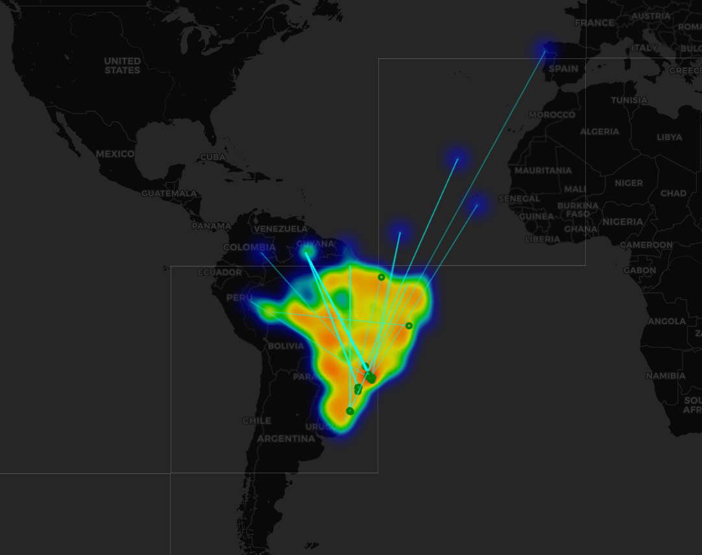
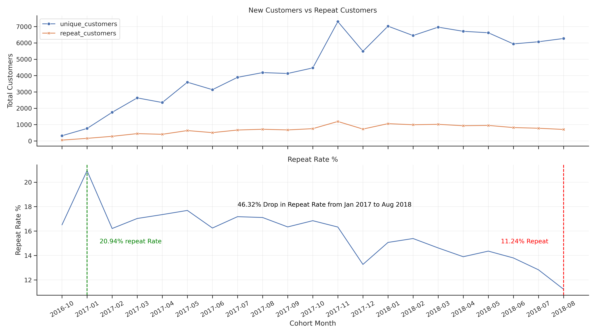
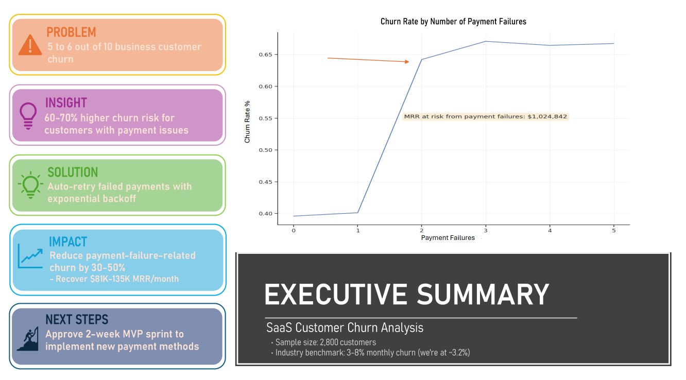

# Data Analysis Portfolio - Ahmed Elatwy

------------------------------------------------------------------------------------------------------------

## Data Analyst | Turning Data into Revenue-Driving Insights  

**I help e-commerce & industrial businesses reduce churn, optimize pricing, and uncover hidden profit using data you already have.**

🚀 Let's Fix Your Data  
→ email "AUDIT" to ahmed.abbas.elatwy@gmail.com for a free dataset review  

*Response time: <24 hours. No obligation. 100% confidential.*

------------------------------------------------------------------------------------------------------------
## 👋 Why Work With Me?

I'm not just a data analyst. I'm a Geophysics graduate + R&D Chemist who learned to translate complex industrial data into business decisions. I understand the Egyptian market, speak your language, and deliver insights you can actually use.

------------------------------------------------------------------------------------------------------------

## 🛠️ Technical Skills

| Category | Technologies |
|----------|--------------|
| **Programming** | Python, SQL |
| **Libraries** | Pandas, NumPy, Matplotlib, Seaborn, Scikit-learn |
| **Visualization** | Power BI, Excel, Tableau, Plotly |
| **Tools** | Jupyter Notebook, Git, GitHub |
| **Methodologies** | Data Cleaning, EDA, Statistical Analysis, Retention Analysis, Machine Learning |

------------------------------------------------------------------------------------------------------------
## 📦 How I Can Help You

| Service | What You Get | Investment |
|---------|-------------|------------|
| **Data Health Check** | 1-page audit + 3 actionable insights | 150 EGP (~$5) |
| **Mini Dashboard** | Power BI dashboard, 3 KPIs, weekly updates | 600 EGP (~$10) |
| **Custom Analysis** | Churn, pricing, logistics—scoped to your needs | Quote (starting 1,200 EGP) |

*Payment via Vodafone Cash, bank transfer, or PayPal. Introductory pricing for first 5 clients.*

👉 [Book a free 15-min call to pick the right starting point](https://calendly.com/ahmed-abbas-elatwy/15min)

------------------------------------------------------------------------------------------------------------

## 🔄 How It Works

1. **Book a free 15-min call** → We clarify your goal & data situation  
2. **Send your dataset** (Excel/CSV) → I analyze & build your deliverable  
3. **Get actionable insights** → You implement, I support  

*Average turnaround: 48 hours for Health Check, 5 days for Mini Dashboard*

------------------------------------------------------------------------------------------------------------

## 📊 Projects Portfolio

### 📈 Case Study: London Real Estate Investment Estimator

- **Client Type**: Real Estate Investment Firms & Property Arbitrage Investors in London

- **Problem**: Price ≠ Value: Traditional analysis misses location nuances and guest sentiment, causing investors to overpay for 'overpriced junk' or miss undervalued gems

- **My Approach**:
  - Built end-to-end ML engine analyzing 96,000 listings with 150+ features
  - applied NLP (VADER) on 50,000+ reviews for sentiment scoring, geospatial engineering (Haversine distance), and XGBoost regression to predict fair market value

- **Result**:
  - Achieved R² of 0.82 (MAE $28)
  - discovered 'Bedrooms & Privacy' drive price 3x more than sentiment
  - properties within 5km of center command 40% premium
  - successfully identified undervalued arbitrage opportunities

- **Tools**: Python, Pandas, NumPy, XGBoost, Scikit-Learn, NLTK (VADER), Folium, Haversine, Streamlit

[Live App](https://london-real-estate-investment-estimator.streamlit.app/) | [GitHub](Projects/London-Real-Estate-Investment-Estimator--main)

------------------------------------------------------------------------------------------------------------

### 📈 Case Study: E-Commerce Data Analysis & Customer Segmentation

- **Client Type:** Transnational E-Commerce Retailer (B2B/B2C) with 4,200+ customers across multiple countries

- **Problem:** No unified view of customer value or behavior: marketing spend was inefficient, churn was unaddressed, and high-value segments were being overlooked  

- **My Approach:**
  - Analyzed 540K+ transactions using Python (Pandas, RFM + Cohort analysis)
  - engineered a two-tier dataset strategy to separate financial reporting from behavioral analysis
  - built interactive Power BI dashboard for executive decision-making

- **Result:**
  - Identified 'Champions' segment (643 customers) driving ~80% of revenue
  - discovered 80% of daily revenue concentrates on Thursdays 10AM–3PM
  - revealed 3-month retention drop-off; delivered 4 actionable strategies including VIP program and targeted win-back campaigns

- **Tools:** Python, Pandas, NumPy, Matplotlib, Seaborn, Power BI, Tableau, Git/GitHub  

**[Kaggle Notebook](https://www.kaggle.com/code/ahmedealtwy/e-commerce-analysis) | [GitHub](Projects/E-Commerce-Analysis) | [Executive Summary PDF](https://github.com/AhmedElatwy/E-Commerce-Analysis/blob/f05ce116202147f0e8b7037291c201c1ea2b6f4c/Excutive%20Summary.pdf)**

------------------------------------------------------------------------------------------------------------

### 📈 Case Study: London Bike-Sharing Demand Forecasting

- **Client Type:** "Urban Mobility Operator Managing London's Public Bike-Sharing Fleet"  

- **Problem:** Unpredictable demand spikes and weather-driven fluctuations caused inefficient fleet redistribution, leading to empty stations during rush hour and idle bikes during off-peak times

- **My Approach:**
  - Analyzed 2+ years of historical ride data (2015-2017) combined with weather APIs
  - engineered temporal features (hourly/weekly patterns) and trained a Random Forest Regressor to forecast demand at station-level granularity

- **Result:**
  - Achieved R² of 0.95 in demand prediction
  - identified commuter-driven peaks at 8AM/5PM, temperature as the #1 demand driver, and 39% rain-induced drop with 61% user retention
  - enabled data-backed staffing and maintenance scheduling

- **Tools:** Python, Pandas, Scikit-Learn (Random Forest), Matplotlib, Seaborn, Weather APIs  

**[GitHub Repository](Projects/London-Bike-Sharing-Analysis)**

------------------------------------------------------------------------------------------------------------

### [Telco Customer Churn Analysis](Projects/Telco-Customer-Churn-Analysis)
### 📈 Case Study: Telco Customer Churn Analysis

- **Client Type:** Mid-size Telecommunications Provider Facing High Customer Attrition

- **Problem:** Customer churn costing millions annually, with no clear visibility into *who* is leaving, *why*, or *when* to intervene

- **My Approach:**
  - Analyzed telecom customer dataset using Python (Pandas, Scikit-Learn)
  - performed exploratory analysis to identify churn drivers
  - built predictive segmentation
  - designed an interactive Power BI-style dashboard for retention teams

- **Result:**
  - Discovered month-to-month customers churn at 42.7% vs 2.9% for 2-year contracts
  - 55.5% of churn happens in Year 1; security services reduce churn risk by 65%
  - electronic check users are 3x more likely to leave → delivered 4 targeted retention strategies

- **Tools:** Python, Pandas, NumPy, Matplotlib, Seaborn, Scikit-Learn, Power BI (Dashboard)  

**[Kaggle Notebook](https://www.kaggle.com/code/ahmedealtwy/analyze-customer-churn-for-a-telecom-company) | [GitHub](Projects/Telco-Customer-Churn-Analysis)**

------------------------------------------------------------------------------------------------------------

### 📈 Case Study: Store Sales Forecasting

- **Client Type:** Drugstore Retail Chain Operating 1,115 Stores

- **Problem:** Inaccurate 6-week sales forecasts led to costly stockouts and overstocking, disrupting inventory operations across 1,115 stores

- **My Approach:**
  - Conducted Time Series EDA to uncover weekly seasonality (Sunday closures) and promotion impact
  - engineered features for seasonality and business events
  - identified and resolved critical data leakage by removing future 'Customers' variable
  - trained Random Forest Regressor for production-ready forecasting

- **Result:**
  - Quantified promotions drive ~$3,000/day median sales lift
  - achieved R² of 0.85 (MAE $600-800) in production-realistic conditions
  - model accurately predicted sales spikes and Sunday closure drops for reliable inventory planning

- **Tools:** Python, Scikit-Learn, Random Forest, Pandas, Time Series Analysis, Feature Engineering, Streamlit  

**[Live Streamlit App](https://rossman-store-sales-forecasting.streamlit.app/) | [GitHub](Projects/Store-Sales-Forecasting)**

------------------------------------------------------------------------------------------------------------

### 📈 Case Study: E-Commerce Revenue & Logistics Analysis (SQL)

- **Client Type:** Brazilian Multi-Category E-Commerce Marketplace with 100K+ Orders

- **Problem:** CMO lacked visibility into revenue drivers and high-value customers; Operations team couldn't pinpoint root causes of 29-day delivery delays in remote Amazon regions; Logistics needed network visualization to validate warehouse placement

- **My Approach:**
  - Built SQLite relational database querying 100K+ orders across 9 tables;
  - engineered SQL + Python pipeline joining 5 relational tables to link orders to geocoordinates;
  - calculated Haversine Distance via Vectorized NumPy; solved 'Session vs. User' identity using customer_unique_id for LTV;
  - applied CTEs + Window Functions (LAG) for retention analysis  

- **Result:**
  - Identified Health & Beauty as top category with exponential growth ($134→$119K/month)
  - pinpointed Northern Region bottleneck (29-day avg delivery in RR/AP/AM)
  - generated VIP list (Top Whale: R$13.4K) for loyalty program; visualized 'Last Mile' density confirming need for São Paulo distribution hubs
  - flagged international shipping anomalies for data governance review  

- **Tools:** SQL (SQLite), Python (Pandas, NumPy, Folium), Geospatial Analysis (Haversine), Window Functions, CTEs  

**[GitHub Repository](Projects/E-Commerce-Revenue-Logistics-Analysis-SQL)**

------------------------------------------------------------------------------------------------------------
### 📈 Case Study: Olist E-Commerce Retention Analysis
- **Client Type:** Brazilian Multi-Category E-Commerce Marketplace (Olist) with 100K+ Orders

- **Problem:** 96.9% of customers never make a second order; no visibility into why customers don't return or where the biggest revenue opportunities lie for improving retention

- **My Approach:**
  - Analyzed 100K+ completed orders using Python (Pandas, SciPy)
  - filtered for delivered orders, excluded incomplete cohorts (<60 days)
  - applied statistical validation (linear regression) to identify retention trends
  - modeled revenue impact of improving repeat purchase rates

- **Result:**
  - Quantified 3.12% repeat purchase rate; identified +312K BRL (~$62K) monthly revenue opportunity if rate improves to 5%
  - discovered Home Essentials retain 2.5x better than Toys/Gifts (26% vs 10%)
  - detected statistically significant -0.28%/month retention decline (p<0.001)
  - Delivered 3 prioritized, ROI-backed retention strategies

- **Tools:** Python, Pandas, NumPy, Matplotlib, Seaborn, SciPy (linregress), Statistical Modeling

[GitHub Repository](Projects/Olist-Retention-Analysis) | [Notebook](Projects/Olist-Retention-Analysis/outputs/Olist-Retention-Analysis.ipynb)

------------------------------------------------------------------------------------------------------------

### 📈 Case Study: SaaS Customer Churn & Payment Friction Analysis

**Client Type:** B2B SaaS Company with Subscription Revenue Model (2,800 Customer Records)

- **Problem:** 
  - 57.3% overall churn rate (~3.2% monthly) with $1M+ MRR at risk
  - no clarity on whether churn was driven by plan type, product fit, or operational friction like payment failures

- **My Approach:** 
  - Analyzed 2,800 customer records using Python (Pandas, SciPy)
  - applied chi-square testing to validate plan-level churn differences
  - modeled revenue impact of payment failure interventions
  - prioritized recommendations using statistical significance + business impact + effect size framework

- **Result:** 
  - Identified payment failures (2+) as primary churn driver (60-70% higher risk), NOT plan type (p=0.63)
  - Quantified $270K salvageable MRR from at-risk active customers
  - Projected $81K-135K/month recoverable revenue with 30-50% churn reduction
  - Delivered 3 prioritized, ROI-backed retention plays with <1-month payback  

- **Tools:** Python, Pandas, NumPy, Matplotlib, Seaborn, SciPy (Chi-Square, Statistical Modeling), Revenue Forecasting  

**[GitHub Repository](Projects/SaaS-Customer-Churn-Payment-Friction-Analysis)**

---

------------------------------------------------------------------------------------------------------------

## 📫 Connect With Me

🚀 Let's Fix Your Data  
→ email "AUDIT" to [ahmed.abbas.elatwy@gmail.com](mailto:ahmed.abbas.elatwy@gmail.com) for a free dataset review  

Available for calls Sat-Thu, 5 PM → 1 AM EET (Cairo time).

*Response time: <24 hours. No obligation. 100% confidential.*

------------------------------------------------------------------------------------------------------------

## 📄 Certifications

- IBM Professional Data Analyst
- Google Advanced Data Analysis
- Bachelor of Science

------------------------------------------------------------------------------------------------------------

*This portfolio is continuously updated with new projects and improvements.*
