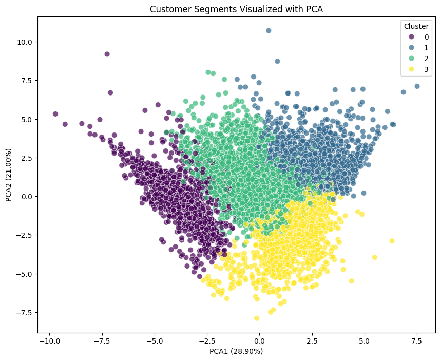

# Data Analysis Portfolio - Ahmed Elatwy

## 👨‍💻 About Me

I'm a passionate Data Analyst with a Bachelor of Science degree, certified through IBM Professional Data Analyst and Google Advanced Data Analysis programs. I specialize in transforming complex datasets into actionable insights using Python, Power BI, and Excel.

**Technical Skills:**
- **Programming:** Python (Pandas, NumPy, Matplotlib, Seaborn, Scikit-learn)
- **Data Visualization:** Power BI, Excel, Matplotlib, Seaborn
- **Data Analysis:** Statistical Analysis, Data Cleaning, EDA, Predictive Modeling
- **Tools:** Jupyter Notebook, Git, SQL, Excel Advanced Formulas

## 📊 Projects Portfolio

### [London Real Estate Investment Estimator](Projects/London-Real-Estate-Investment-Estimator--main)
**Tools:** SQL, Pandas, Folium, Numpy, Streamlit, Statistics, NLP, Geospatial, ML

•	NLP: VADER Sentiment Analysis on 50,000+ guest reviews.

•	Geospatial: Haversine Distance calculation & Folium Cluster Mapping.

•	ML: XGBoost Regressor (R²: 0.82, MAE: $28).

### [E-Commerce Business Analysis](Projects/E-Commerce-Analysis)
**Tools:** Power BI, Python, Statistics
- Developed comprehensive sales dashboards
- Analyzed customer behavior and purchase patterns
- Identified growth opportunities and seasonal trends

### [London Bike Sharing Analysis](Projects/London-Bike-Sharing-Analysis)
**Tools:** Power BI, Python, Statistics
- Built a full-stack data solution combining a Python machine learning model for future predictions and a Power BI dashboard for historical analysis.
- Engineered a Random Forest regression model (Scikit-learn) to forecast bike demand based on weather and time data, achieving high accuracy.
- Designed a dynamic Power BI dashboard to uncover usage patterns (seasonality, peak hours), utilizing Power Query for advanced ETL and data transformation.

### [Telco Customer Churn Analysis](Projects/Telco-Customer-Churn-Analysis)
**Tools:** Power BI, Python, Statistics
- Identify key drivers of customer churn
- Predict customers at high risk of leaving
- Provide actionable insights for retention strategies
- Reduce churn rates through data-driven interventions

### [Store Sales Forecasting](Projects/Store-Sales-Forecasting)
**Tools:** Power BI, Python, Statistics, Forecasting, Streamlit

[Streamlit Live Web Interface for Real-Time Prediction.](https://rossman-store-sales-forecasting.streamlit.app/)
- Predicted daily sales 6 weeks in advance for a retail chain to optimize inventory planning.
- Engineered Time Series features (Seasonality, Holidays) and quantified the business impact of Promotions (Median sales lift of ~$3,000).
- Identified and resolved a critical Data Leakage issue (future customer counts), delivering a realistic and robust Random Forest Regressor model.

### [E-Commerce Revenue Logistics Analysis (SQL)](Projects/E-Commerce-Revenue-Logistics-Analysis-SQL)
**Tools:** SQL, Python, Statistics, Supply Chain

-	Analyzed a 100k+ row e-commerce database to diagnose revenue trends and logistical bottlenecks.
-	Utilized Advanced SQL (Joins, Date Math) to link 9 relational tables and calculate lead times across different states.
- Uncovered a 29-day delivery lag in Amazonian states and identified the "Health & Beauty" category as the primary revenue engine ($119k/month).

### [Credit Card Customer Segmentation](Projects/Customer-Segmentation-Strategy)
**Tools:** Power BI, Python, Statistics, Segmentation
- Segmented a customer base to replace generic marketing with targeted, behavior-based campaigns.
- Applied K-Means Clustering and PCA on financial data, utilizing Logarithmic Transformations to handle "Whale" outliers without losing data integrity.
- Identified 4 distinct personas (e.g., "Sleeping Giants," "VIP Spenders") and drafted specific retention and activation strategies for each segment.
  

### [Automated Lithology Prediction using Well Log Data](Projects/Automated-Lithology-Prediction-using-Well-Log-Data)
**Tools:** Power BI, Python, Statistics, Petrophysics
- Built a Machine Learning pipeline to automate rock type classification (Sandstone vs. Shale) from raw well log data.
- Leveraged geophysics knowledge to perform domain-specific cleaning, choosing to drop unreliable PEF logs while preserving the "Triple Combo" signal.
- Trained a Random Forest Classifier achieving 91.7% accuracy and 95% recall on reservoir sandstones, validated via a blind-test log plot.

### [Logistics Bottleneck Analysis (Supply Chain)](Projects/Logistics-Bottleneck-Analysis)
**Tools:** Power BI, Python, Statistics, Supply Chain
- Investigated the root causes of a 60% late delivery rate for an international logistics firm.
- Discovered a critical "Discount Cliff," revealing that shipments with >10% discounts were systematically deprioritized and delayed.
- Built an operational Power BI dashboard tracking warehouse performance and provided data-driven recommendations to optimize shipping priority rules.

### [IBM HR Analysis](Projects/IBM-HR-Analysis)
**Tools:** Power BI, Python, Statistics
- Disproved the common belief that "lack of promotions" causes attrition.
- Identified a "Toxic Zone" where Sales Representatives working Overtime with low pay had a 40% attrition rate.
- Built a predictive model (Accuracy: 88.8%) that flags high-risk employees before they quit.
    
### [Retail Strategy Analytics - Chip Category Performance](Projects/Retail-Strategy-Analytics-Chip-Category-Performance-Analysis)
**Tools:** Python, Pandas, Matplotlib, Statistical Analysis
- Analyzed chip category performance across multiple regions
- Identified key drivers of sales and customer preferences
- Provided strategic recommendations for product placement and promotions

### [Social Media Emotions Analysis](Projects/Social-Media-Emotions)
**Tools:** Python, Text Analysis, Machine Learning
- Performed sentiment analysis on social media posts
- Classified emotions using machine learning algorithms
- Visualized emotional trends and patterns

### [British Airways Reviews Analysis](Projects/British-Airways-Reviews-Analysis)
**Tools:** Python, Web Scraping, Sentiment Analysis
- Collected and analyzed customer reviews
- Identified key satisfaction drivers and pain points
- Provided insights for service improvement

### [Stock Market Analysis (2020-2024)](Projects/Stock-Market-Analysis-2020-2024)
**Tools:** Python, Financial Analysis, Time Series
- Analyzed stock performance across multiple sectors
- Identified market trends and volatility patterns
- Developed risk assessment models

### [Global Traffic Index Analysis](Projects/Traffic-Index)
**Tools:** Python, Data Visualization, Comparative Analysis
- Analyzed traffic patterns across major cities
- Identified congestion factors and peak hours
- Provided urban planning insights

### [Retail Sales Analysis](Projects/retail-analysis)
**Tools:** Excel, Power BI, Business Intelligence
- Comprehensive sales performance analysis
- Inventory optimization recommendations
- Customer segmentation and targeting strategies

### [International Retail Sales Analysis](Projects/International_retail_sales_analysis)
**Tools:** Power BI, Comparative Analysis, Market Research
- Cross-country sales performance comparison
- Market entry strategy recommendations
- Cultural and regional buying pattern analysis

### [Supermarket Performance Analysis](Projects/SuperMarket_Analysis)
**Tools:** Excel, Data Modeling, Business Analytics
- Store performance benchmarking
- Product category optimization
- Customer loyalty program analysis

### [Real Estate House Sales Analysis](Projects/HouseSales)
**Tools:** Python, Real Estate Analytics, Geographic Analysis
- Property value trend analysis
- Location-based pricing strategies
- Market demand forecasting

### [IBM Data Analytics Capstone](Projects/ibm-capstone)
**Tools:** Python, End-to-End Data Analysis, Machine Learning
- Comprehensive data analysis project covering entire pipeline
- Predictive modeling and business insights
- Final capstone project for IBM certification

## 🛠️ Technical Skills

| Category | Technologies |
|----------|--------------|
| **Programming** | Python, SQL |
| **Libraries** | Pandas, NumPy, Matplotlib, Seaborn, Scikit-learn |
| **Visualization** | Power BI, Excel, Plotly |
| **Tools** | Jupyter Notebook, Git, GitHub |
| **Methodologies** | Data Cleaning, EDA, Statistical Analysis, Machine Learning |

## 📫 Connect With Me

- **Email:** ahmed.abbas.elatwy@gmail.com
- **GitHub:** [https://github.com/AhmedElatwy](https://github.com/AhmedElatwy)

## 📄 Certifications

- IBM Professional Data Analyst
- Google Advanced Data Analysis
- Bachelor of Science

---

*This portfolio is continuously updated with new projects and improvements.*
